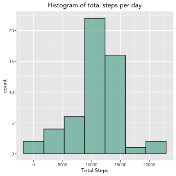
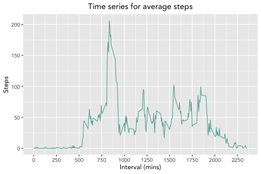
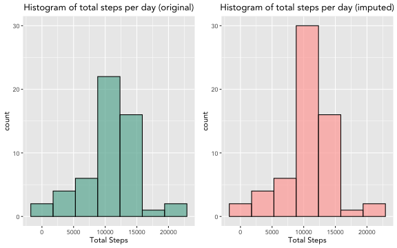
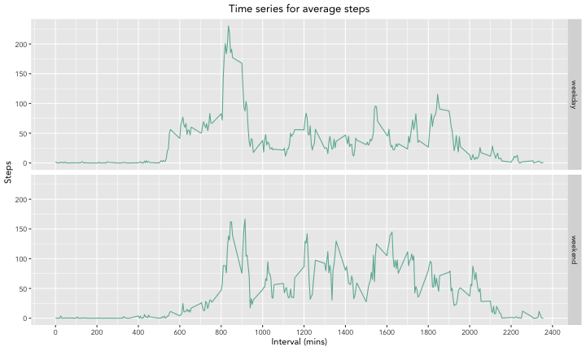

Reproducible Research Peer-graded Assignment 1
==============================================
  
**Author:** Maria Daniela Gracia  
**Course:** Reproducible Research  
**Introduction:** This report answers the questions/tasks required in the first peer graded assignment of this course.  
    
### 1. Loading and preprocessing the data
In this step the data is loaded and modified to be more suitable for analysis.  
  

```r
# first we load the data
unzip("activity.zip")
mydata <- read.csv("activity.csv", header = TRUE, sep = ",")

# second we convert the dates to date format
mydata$date<-as.Date(mydata$date,"%Y-%m-%d")
```
  

```r
# Here we load the packages needed for the analysis.
library(dplyr)
library(knitr)
library(kableExtra)
library(ggplot2)
library(gridExtra)  
```
  
### 2. What is mean total number of steps taken per day?  
  
#### a) Calculate the total number of steps taken per day.  

```r
# first we remove the rows with missing values
completedata <- na.omit(mydata)

# second we group the data by date & find the total number of steps for each day
totalSteps <- completedata %>% group_by(date) %>% summarise(total_steps=sum(steps))

# finally we print the head
head(totalSteps, n=10)
```

```
## # A tibble: 10 x 2
##    date       total_steps
##    <date>           <int>
##  1 2012-10-02         126
##  2 2012-10-03       11352
##  3 2012-10-04       12116
##  4 2012-10-05       13294
##  5 2012-10-06       15420
##  6 2012-10-07       11015
##  7 2012-10-09       12811
##  8 2012-10-10        9900
##  9 2012-10-11       10304
## 10 2012-10-12       17382
```
  
#### b) Make a histogram of the total number of steps taken each day.    

```r
# create histogram with ggplot2
totalSteps %>% ggplot(aes(x=total_steps)) +
        geom_histogram(color="black", fill="#69b3a2", bins=7, alpha=.7) + 
        theme(text=element_text(family ="Avenir") ) +
        labs(x = "Total Steps", title = "Histogram of total steps per day") +
        theme(plot.title = element_text(hjust = 0.5, face = "bold"))
```


    
#### c) Calculate and report the mean and median of the total number of steps taken per day.    
  
First we calculate the values  

```r
# first we find the mean and median number of steps for each day
meanSteps <- mean(totalSteps$total_steps)
medianSteps <- median(totalSteps$total_steps)
print(meanSteps)
```

```
## [1] 10766.19
```

```r
print(medianSteps)
```

```
## [1] 10765
```
  
And then to report them we put them in a table using the kableExtra package:    
  

```r
# second we report these results in a table
tab <- cbind(meanSteps, medianSteps)
colnames(tab) <- c("mean steps", "median steps")
tab %>% kbl(caption = "") %>%
        kable_paper(full_width = F, position="left", html_font = "Avenir")
```

<table class=" lightable-paper" style="font-family: Avenir; width: auto !important; ">
<caption></caption>
 <thead>
  <tr>
   <th style="text-align:right;"> mean steps </th>
   <th style="text-align:right;"> median steps </th>
  </tr>
 </thead>
<tbody>
  <tr>
   <td style="text-align:right;"> 10766.19 </td>
   <td style="text-align:right;"> 10765 </td>
  </tr>
</tbody>
</table>
  
### 3. What is the average daily activity pattern?  
  
#### a) Make a time series plot (i.e type = "l") of the 5-minute interval (x-axis) and the average number of steps taken, averaged across all days (y-axis)  

```r
# first we group the data by intervals and calculate the average for each interval
grouped <- completedata %>% group_by(interval) %>% summarise(average=mean(steps))
```
  

```r
# second we plot the time series using ggplot2
grouped %>% 
        ggplot(aes(x=interval, y=average)) +
        geom_line(color="#69b3a2") +
        scale_x_continuous(breaks = seq(0, 2500, by = 250)) +
        labs(x = "Interval (mins)", y="Steps", 
             title = "Time series for average steps") +
        theme(text=element_text(family ="Avenir") ) +
        theme(plot.title = element_text(hjust = 0.5, face = "bold"))
```


  
#### b) Which 5-minute interval, on average across all the days in the dataset, contains the maximum number of steps?  

```r
# now we calculate the 5 minute interval with the maximum number of steps
maxinter <-grouped[[which.max(grouped$average),1]]
print(maxinter)
```

```
## [1] 835
```
  
The 5-minute interval, on average across all the days in the dataset, which contains the maximum number of steps is **<span style="color:blue">835</span>**.  

### 4. Imputing missing values    
   
#### a) Calculate and report the total number of missing values in the dataset (i.e. the total number of rows with NAs)    

```r
# we calculate the total number of missing values
missing <- sum(is.na(mydata$steps))
print(missing)
```

```
## [1] 2304
```
  
The total number of missing values in the dataset is **<span style="color:blue">2304</span>**.     
     
#### b) Devise a strategy for filling in all of the missing values in the dataset. The strategy does not need to be sophisticated. For example, you could use the mean/median for that day, or the mean for that 5-minute interval, etc.    
     
For this I have decided to fill in the missing values with the mean value for that given 5-minute interval using a for loop.    
     
#### c) Create a new dataset that is equal to the original dataset but with the missing data filled in.  

```r
# first we create a new dataset mydata1, which for now is a copy of the original dataset # mydata
mydata1 <- mydata

# second we loop trough the data set replacing the missing values
for(i in 1:nrow(mydata)){ 
        if (is.na(mydata[i,1])==TRUE) {
                group <- mydata[i,3] 
                therow <- which(grouped$interval==group)
                newNA <- grouped[therow,2]
                mydata1[i,1] <- newNA 
        }
        else{
        mydata1[i,1] <- mydata[i,1]
        }
} 

# now to show that the missing values have been replaced we check the number of missing # values
missing1 <- sum(is.na(mydata1$steps))
print(missing1)
```

```
## [1] 0
```
    
The total number of missing values in the new dataset is **<span style="color:blue">0</span>**. which means we were able to get replace all the missing values from the original data set! just to show this we will print the summary for the new dataset.       

```r
summary(mydata1)
```

```
##      steps             date               interval     
##  Min.   :  0.00   Min.   :2012-10-01   Min.   :   0.0  
##  1st Qu.:  0.00   1st Qu.:2012-10-16   1st Qu.: 588.8  
##  Median :  0.00   Median :2012-10-31   Median :1177.5  
##  Mean   : 37.38   Mean   :2012-10-31   Mean   :1177.5  
##  3rd Qu.: 27.00   3rd Qu.:2012-11-15   3rd Qu.:1766.2  
##  Max.   :806.00   Max.   :2012-11-30   Max.   :2355.0
```
    
#### d) Make a histogram of the total number of steps taken each day.  
  
We will plot a histogram of the data set with imputed missing values side by side with the histogram plotted previously (where NA's are removed):   
      

```r
# first we group the data by date & find the total number of steps for each day for the # new dataset
totalSteps1 <- mydata1 %>% group_by(date) %>% summarise(total_steps=sum(steps))
# second we create a histogram for new dataset with ggplot2
plot2 <- totalSteps1 %>% ggplot(aes(x=total_steps)) +
        geom_histogram(color="black", fill="#ffaaa5", bins=7, alpha=.7) + 
        theme(text=element_text(family ="Avenir") ) +
        labs(x = "Total Steps", 
        title = "Histogram of total steps per day (imputed)") +
        theme(plot.title = element_text(hjust = 0.5, face = "bold"))
# third we create a histogram for the original dataset with ggplot2
plot1 <- totalSteps %>% ggplot(aes(x=total_steps)) +
        geom_histogram(color="black", fill="#69b3a2", bins=7, alpha=.7) + 
        theme(text=element_text(family ="Avenir") ) +
        labs(x = "Total Steps", 
        title = "Histogram of total steps per day (original)") +
        theme(plot.title = element_text(hjust = 0.5, face = "bold")) + 
        ylim(0, 30)
# finally we print them side by side
grid.arrange(plot1, plot2, ncol = 2)  
```


    
#### e) Calculate and report the mean and median total number of steps taken per day. Do these values differ from the estimates from the first part of the assignment? What is the impact of imputing missing data on the estimates of the total daily number of steps?     
    

```r
# first we find the mean and median number of steps for each day
meanSteps1 <- mean(totalSteps1$total_steps)
medianSteps1 <- median(totalSteps1$total_steps)
print(meanSteps1)
```

```
## [1] 10766.19
```

```r
print(medianSteps1)
```

```
## [1] 10766.19
```
  
And then we put them in a table using the kableExtra package     
   

```r
# second we report these results in a table
tab1 <- cbind(meanSteps1, medianSteps1)
colnames(tab1) <- c("mean steps", "median steps")
tab1 %>% kbl(caption = "") %>%
        kable_paper(full_width = F, position="left", html_font = "Avenir")
```

<table class=" lightable-paper" style="font-family: Avenir; width: auto !important; ">
<caption></caption>
 <thead>
  <tr>
   <th style="text-align:right;"> mean steps </th>
   <th style="text-align:right;"> median steps </th>
  </tr>
 </thead>
<tbody>
  <tr>
   <td style="text-align:right;"> 10766.19 </td>
   <td style="text-align:right;"> 10766.19 </td>
  </tr>
</tbody>
</table>
    
From the table above we can see that imputing the data has two effects:  
  
**1.** The mean remains the same.  
**2.** The median changes to the mean.  
  
The impact of imputing the data changes the distribution of the dataset, the median changes and the count/frequency of steps in the 4th bin increases.  
    
### 5. Are there differences in activity patterns between weekdays and weekends?   
   
#### a) Create a new factor variable in the dataset with two levels – “weekday” and “weekend” indicating whether a given date is a weekday or weekend day.    

```r
# first we create a function that categorizes the days as weekend or weekday
weekend <- c("Saturday","Sunday")
weekday <- c("Monday","Tuesday","Wednesday","Thursday","Friday")
category <- function(x){
    sapply(x, function(x) if(x %in% weekend) "weekend" else if (x %in% weekday) "weekday")
}

# second we create two new variables, day which states the day of the week for each 
# measurement and factor which uses the function we created above and categorizes the 
# data as weekend or weekday. After this we make the factor variable a factor.
day <- weekdays(mydata1$date)
mydata1$factor_day <- category(day)
mydata1$factor_day <- as.factor(mydata1$factor_day)

# here we can see the new variable we created and it's class
head(mydata1)
```

```
##       steps       date interval factor_day
## 1 1.7169811 2012-10-01        0    weekday
## 2 0.3396226 2012-10-01        5    weekday
## 3 0.1320755 2012-10-01       10    weekday
## 4 0.1509434 2012-10-01       15    weekday
## 5 0.0754717 2012-10-01       20    weekday
## 6 2.0943396 2012-10-01       25    weekday
```

```r
class(mydata1$factor_day)
```

```
## [1] "factor"
```

#### b) Make a panel plot containing a time series plot (i.e. type = "l") of the 5-minute interval (x-axis) and the average number of steps taken, averaged across all weekday days or weekend days (y-axis).


```r
weekend1 <- filter(mydata1, factor_day == "weekend")
weekday1 <- filter(mydata1, factor_day == "weekday")

groupedWeekend <- weekend1 %>% group_by(interval) %>% summarise(average = mean(steps)) %>% mutate(day ="weekend")

groupedWeekday <- weekday1 %>% group_by(interval) %>% summarise(average = mean(steps)) %>% mutate(day ="weekday")

completedata1 <- rbind(groupedWeekday,groupedWeekend)
completedata1 %>% 
        ggplot(aes(x=interval, y=average)) +
        geom_line(color="#69b3a2") +
        facet_grid(day~.) +
        scale_x_continuous(breaks = seq(0, 2500, by = 200)) +
        labs(x = "Interval (mins)", y="Steps", 
             title = "Time series for average steps") +
        theme(text=element_text(family ="Avenir") ) +
        theme(plot.title = element_text(hjust = 0.5, face = "bold"))
```


 
       
